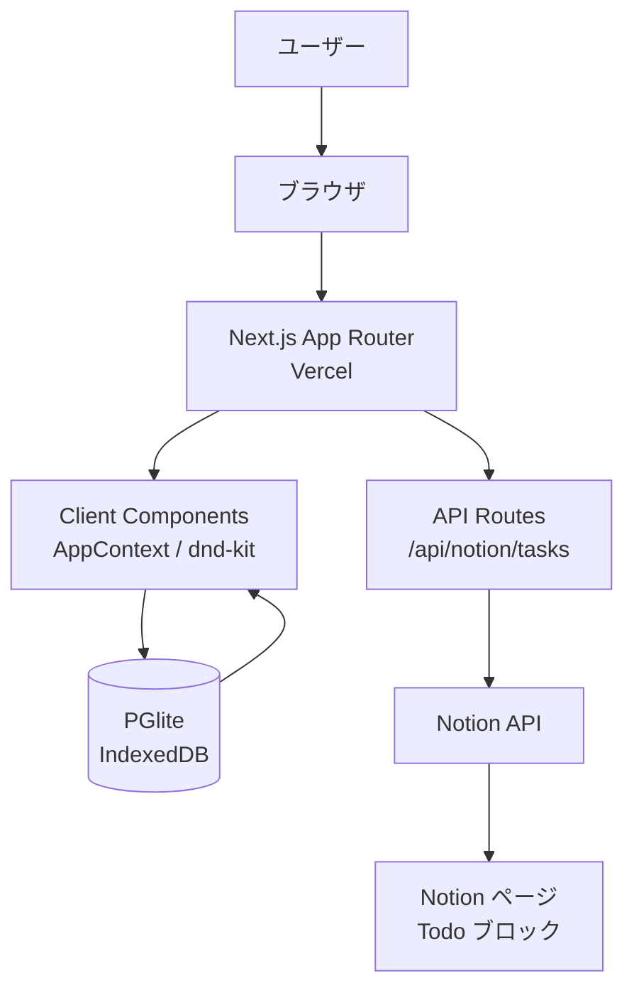

# 🎁 Rewardo

[](https://nextjs.org/)
[](https://www.typescriptlang.org/)
[](https://tailwindcss.com/)
[](https://opensource.org/licenses/MIT)
[](https://reward-orcin.vercel.app/)

> **タスクを完了するたびに「ご褒美ガチャ」が引けるモチベーション管理アプリ**

「いつ当たるかわからない」スロット的なランダム性で、自然にタスクを続けたくなります。Notion の Todo と連携して、既存のワークフローをそのまま活用できます。

🔗 **ライブデモ**: [https://reward-orcin.vercel.app/](https://reward-orcin.vercel.app/)

---

## スクリーンショット

| ホーム画面 | ご褒美設定 | ご褒美・パターン登録 |
|:---:|:---:|:---:|
|  |  |  |

---

## 📖 概要

Rewardo は、行動経済学の**変動比率強化スケジュール**（スロットマシンが「いつ当たるかわからないから続けたくなる」原理）をタスク管理に応用したアプリです。「次のタスクを終えたらご褒美が出るかも」という期待感がモチベーションを持続させます。

### なぜ作ったのか

- 既存の Todo アプリには「続けるためのモチベーション設計」が弱いと感じていた
- Notion を日常的に使っており、そのままタスク管理に連携したかった
- Next.js / Notion API / dnd-kit などモダンなスタックの実践経験を積みたかった
- 自分自身が実際に使いたいプロダクトを作りたかった

---

## ✨ 主な機能

- **Notion 同期** — 指定した Notion ページの Todo を取得・表示
- **タスク完了** — チェックを入れると Notion 側も自動で更新
- **ドラッグ並び替え** — タスクの表示順を自由に変更（dnd-kit）
- **ご褒美ガチャ** — 一定数タスクを完了するとランダムにご褒美が出る
- **加重抽選** — ご褒美に重みを設定して出やすさを調整
- **ログイン不要** — データはすべてブラウザ内（PGlite / IndexedDB）に保存

---

## 🛠 技術スタック

| カテゴリ | 技術 |
|:--|:--|
| フロントエンド | Next.js 16（App Router）, React 19, TypeScript 5 |
| スタイリング | Tailwind CSS 4, shadcn/ui, Radix UI |
| データベース | PGlite（WASM PostgreSQL / IndexedDB 永続化） |
| ライブラリ | dnd-kit（ドラッグ&ドロップ）, canvas-confetti（アニメーション） |
| 外部 API | Notion API（@notionhq/client） |
| インフラ | Vercel |
| 開発環境 | Docker（docker compose） |

---

## 🏗 アーキテクチャ



---

## 🚀 はじめ方

### 前提条件

以下のいずれかが必要です。

- **Docker**（Node.js のインストール不要）
- **Node.js 20 以上**

### Notion の準備

#### 1. Notion Integration を作成する

1. [https://www.notion.so/my-integrations](https://www.notion.so/my-integrations) を開く
2. **「新しいインテグレーション」** をクリック
3. 名前を入力（例: `Rewardo`）してワークスペースを選択 → **送信**
4. 表示された **「Internal Integration Secret」** をコピー
   ```
   secret_xxxxxxxxxxxxxxxxxxxxxxxxxxxxxxxxx
   ```

#### 2. Notion ページにインテグレーションを接続する

1. 同期したい Notion ページを開く
2. 右上の **「...」** メニュー → **「コネクト」**
3. 手順 1 で作成したインテグレーション名を選択して接続

#### 3. Page ID を確認する

URL の末尾 32 文字が Page ID です。

```
https://www.notion.so/ページ名-3265e595c6c880f5a32cc8ccf0e5bdfb
                                  ^^^^^^^^^^^^^^^^^^^^^^^^^^^^^^^^
                                  この 32 文字が Page ID
```

---

### セットアップ（Docker を使う場合）

Node.js のインストール不要で起動できます。動作確認済みです。

```bash
# リポジトリをクローン
git clone https://github.com/ryusei2790/reward_notion.git
cd reward_notion

# 起動（初回は依存関係のインストールも自動で行われます）
docker compose up --build
```

起動成功時のログ：

```
✓ Ready in 4.3s
```

[http://localhost:3000](http://localhost:3000) でアクセスできます。

> 2回目以降は `docker compose up` だけでOKです。

---

### セットアップ（Node.js を使う場合）

```bash
# リポジトリをクローン
git clone https://github.com/ryusei2790/reward_notion.git
cd reward_notion

# 依存パッケージをインストール
npm install

# 開発サーバーを起動
npm run dev
```

[http://localhost:3000](http://localhost:3000) でアクセスできます。

---

## ⚙️ 初回設定

アプリ起動後、ヘッダーの **「ご褒美設定」** から以下を設定します。

### Notion 連携

| 項目 | 値 |
|------|------|
| Notion API Key | `secret_...` のトークン |
| Notion Page ID | URL末尾の 32 文字 |

「保存」をクリックすると設定がブラウザ内に保存されます。

### ご褒美を登録する

| 項目 | 説明 |
|------|------|
| ご褒美の内容 | 例：「チョコを食べる」「10分休憩する」 |
| 重み（1〜10） | 数値が大きいほど出やすい（10 は 1 の 10 倍） |

### ご褒美パターンを登録する

「何タスク完了したらご褒美を出すか」の範囲を設定します。

| 例 | 意味 |
|----|------|
| 最小 3 〜 最大 5 | 3・4・5 のどれかで出る |
| 最小 1 〜 最大 1 | 毎回ご褒美が出る（お試し用） |

---

## 📖 使い方

### タスクを同期する

1. ヘッダーの **「タスク」** からホームへ
2. **「Notion 同期」** ボタンをクリック
3. Notion ページの Todo が一覧に表示される

### タスクを完了する

- チェックボックスをクリックすると完了済みになり、Notion 側も自動更新
- 完了済みタスクは下部に薄く表示される

### ご褒美が出るとき

- ヘッダーの進捗バーが伸びていく
- 設定した目標数に達すると confetti アニメーション + ご褒美が表示される

---

## 💾 データの保存先

| データ | 保存先 |
|-------|-------|
| タスク（Notion キャッシュ） | ブラウザ内 IndexedDB（PGlite） |
| ご褒美・パターン | ブラウザ内 IndexedDB（PGlite） |
| 進捗（done_count） | ブラウザ内 IndexedDB（PGlite） |
| Notion API Key / Page ID | ブラウザ内 IndexedDB（PGlite） |

> ブラウザのデータを消去するとすべてのデータが失われます。サーバーへの送信は行いません。

---

## 📄 ライセンス

このプロジェクトは [MIT License](LICENSE) の下で公開されています。
